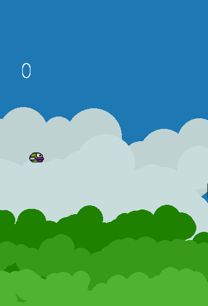

# flypy_byrd
flappy bird clone in pygame

### dependencies
- Python 3.8 and pygame 2

flypy byrd.py does not depend on any other resource. All Artworks and sound are programatically generated. So just copy the file in any place and then execute using python. 



### To run in your device you may need to change this values

```
if __name__=="__main__":
    in_pc = True
    if in_pc:
        width = 355
        height = 520
        conf.change_res(width,height)
        conf.hr_space=250
        conf.pillar_w = 50
        conf.pillar_cap = 25
        conf.vr_space = 100//2
        conf.bird_size = 25
        conf.speed=200
        conf.energy_rate=4
        conf.bird_speed=300
        conf.bg_pos = 200
        conf.cloud_r = (50,100)
        conf.cloud_sp=10
        conf.tree_r=(25,50)
        conf.tree_sp = 2
        conf.bg_h_sub = 20
        conf.vr_variance=10
    conf.cheat=not True
    run()
```
The default config is for 720x1440 res mobile device. You can run this code in pydroid apk.
